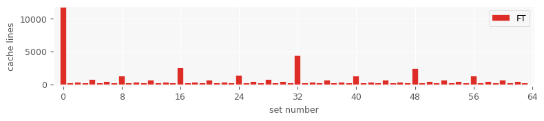
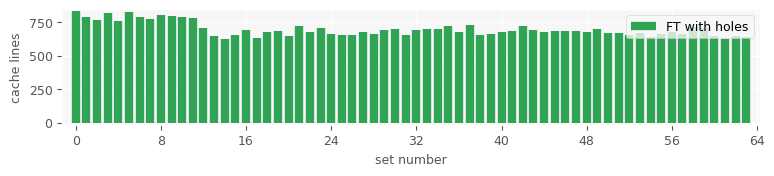
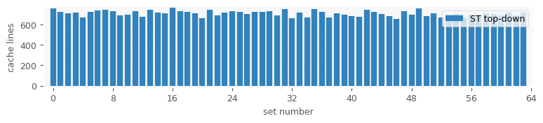
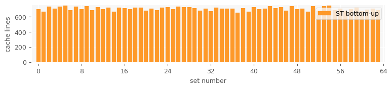

Cache Usage
-----------

Usage:

    ./cache_usage <size>

-------------

A program that simulates a hardware cache and its usage.
In particular, it counts how many *distinct* cache lines
are mapped to the same cache set.
It can be useful to discover potential cache aliasing problems,
occurring when many distinct cache lines are mapped to the same set.

In this test example, I am using a typical 8-way set-associative L1 cache
of size 32 KiB (the class `cache` in the code can be configured to simulate
any cache).
Refer to [this post](https://manybutfinite.com/post/intel-cpu-caches/) to see how a (Intel) n-way set-associative cache works.

I am inspecting the cache usage for 4 different prefix-sum data structures
(only queries are considered here for simplicity; updates are not implemented):
(1) Fenwick-Tree; (2) Fenwick-Tree with holes; (3) Top-Down Segment-Tree;
(4) Bottom-Up Segment-Tree.

A workload of 10,000 random queries is used.

The program shows that the Fenwick-Tree suffers from cache-aliasing for big
values of `<size>`, whereas all other implementations do not.

For example, the following plots show the result of running the program with
`size = 10000000`.

-------------

The plots can be draw by running:

    python3 plot_histograms.py results/ft_results.txt ft
    python3 plot_histograms.py results/ft_holes_results.txt ft_holes
    python3 plot_histograms.py results/st_td_results.txt st_td
    python3 plot_histograms.py results/st_bu_results.txt st_bu

-------------

Also [this](https://pvk.ca/Blog/2012/07/30/binary-search-is-a-pathological-case-for-caches/) post by Paul Khuong illustrates the issue by for
binary search when the array size is close to a large power of 2.
